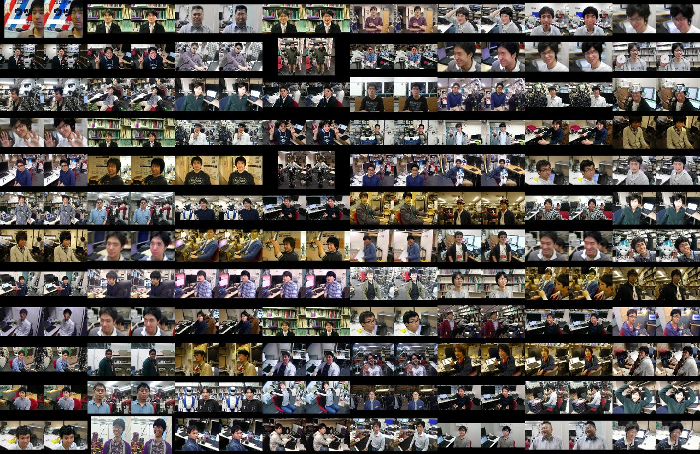
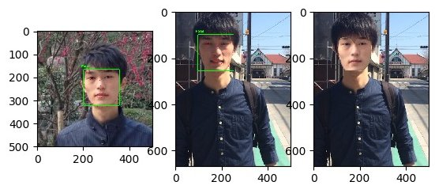

# REAL HAREM

*Transgender of real persons to achieve real harem, with mixed reality on Hololens.*

This is a project in
[the lecture "Intelligent Software"](http://www.mi.t.u-tokyo.ac.jp/ushiku/lectures/is/)
at the University of Tokyo in winter 2017.


## Challenges

- [x] Translate gender of person with remaining his/her face characteristic.
- [x] Track face motion in real time.
- [x] Paste the generated image onto the tracked face naturally. (transgender network won't run in real time, 60fps）
- [ ] Translate gender of clothes.


## Usage


### Hololens demo


**Server**

```bash
# installation
make sample_transgender

cd transgender
sudo bash
source .anaconda3/bin/activate
./runserver.py

# client sample
./sample_post.py
```

**Client (Hololens)**

Author: [@ban-masa](https://github.com/ban-masa)

Deploy https://github.com/ban-masa/HoloFaceSamples/tree/real-harem to Hololens.  
*Please check the URL of server.*


### Convert faces to female

Author: [@wkentaro](https://github.com/wkentaro)

```bash
make sample_transgender  # it translates gender of JSK lab members.
```




### Paste face to face

Author: [@wkentaro](https://github.com/wkentaro)

```bash
make sample_paste_face  # it paste face to face.
```




## Shared data

Google Drive: https://drive.google.com/open?id=1H8EkgFOWPfjuBbdn_w3cQhvdkZgLp7vo
